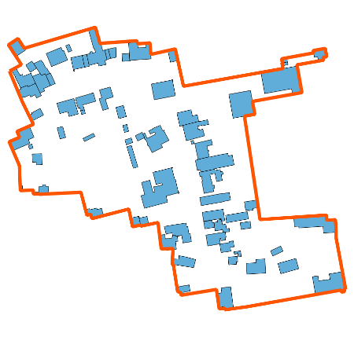

# pgtools
Tools to extend PostGIS functionality

http://gis.stackexchange.com/questions/24428/how-to-aggregate-detached-polygons
## Aggregate polygons

For cartographic purposes, it is often necessary to combine unconnected polygons and generalize them in this way. For example, if groups of individual buildings are to be combined to form a settlement area. With the PostGIS aggregate function aggregatepolygons() developed by Kappasys this aggregation can be done easily.

The aggregate function aggregatepolygons(geometry, double precision, boolean) expects 3 parameters

    the geometry column
    Threshold value within which polygons are grouped into map units
    Orthogonal aggregation of the objects. True=orthogonal and False=not orthogonal. 
    
    
In figure 1 the orthogonal aggregation has been performed. In figure 2 an example of non-orthogonal aggregation

## Installation

To avoid invalid geometries during the aggregation process the PostGIS function cleangeometry() must be installed first (see Downloads).
Only in the second step the aggregation function aggregatepolygons() can be installed.

 

$ psql <dbname> -U <user> -h <server> -f cleanGeometry.sql
$ psql <dbname> -U <user> -h <server> -f aggregatePolygons.sql

 
## Downloads

Geometry Cleaner: https://github.com/hdus/pgtools/blob/master/cleangeometry/cleanGeometry.sql

Polygon Aggregation: https://github.com/hdus/pgtools/blob/master/aggregatepolygons/aggregatePolygons.sql 

## Example 1: Orthogonal aggregation of buildings

Figure 1 shows the result of an orthogonal aggregation of buildings.

 

 

query:

select aggregatepolygons(wkb_geometry, 50, true) from buildings group by art;

Figure 1: Orthogonal aggregation of buildings

## Example 2: Non-orthogonal aggregation

The result of a non-orthogonal aggregation is shown in Figure 2. Usually, natural objects such as forests are aggregated in this way.

query:

select aggregatepolygons(wkb_geometry, 50, false) from forest group by art;

 

Figure 2: Non orthogonal aggregation of natural objects

